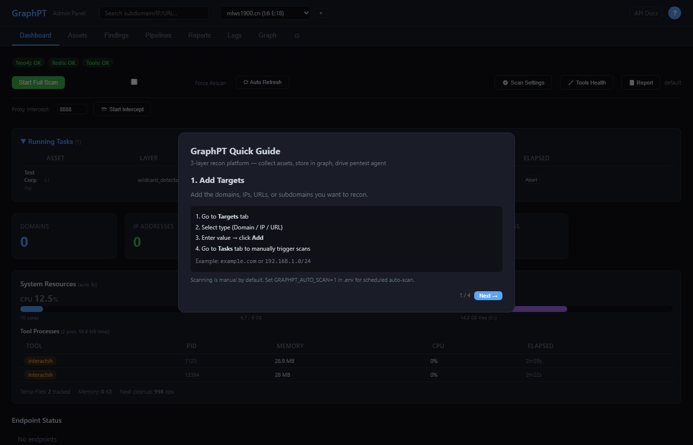
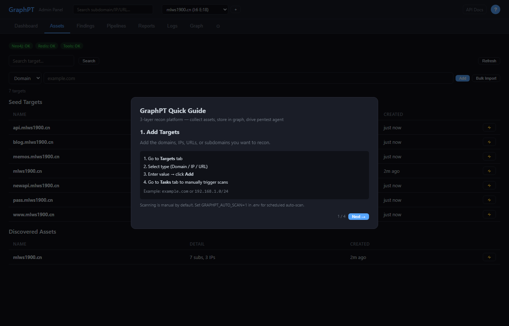
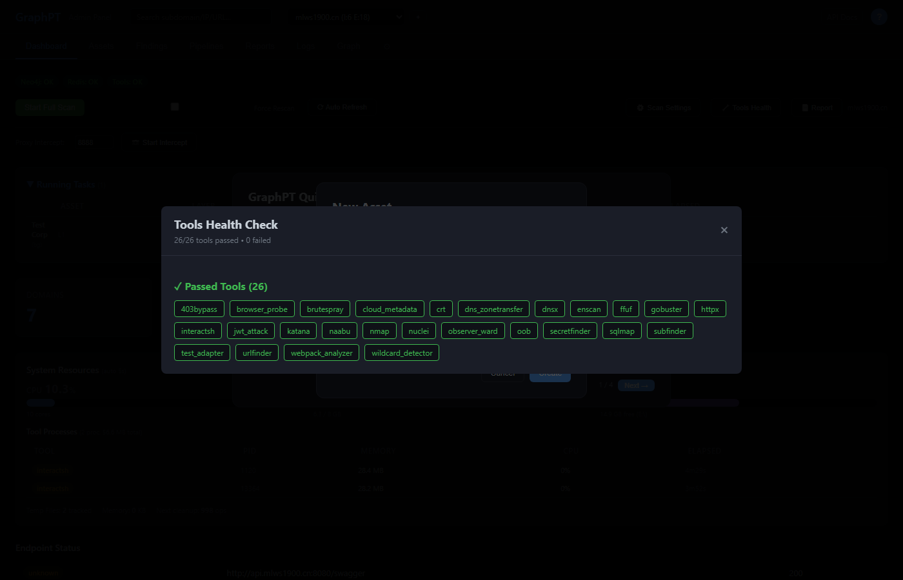
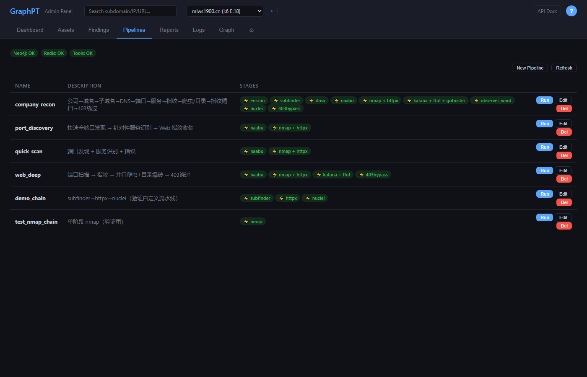
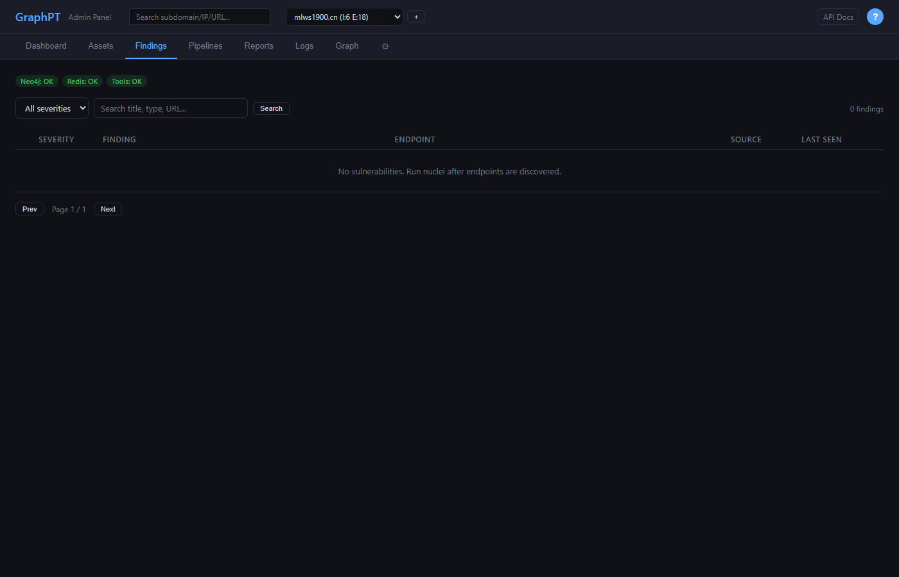
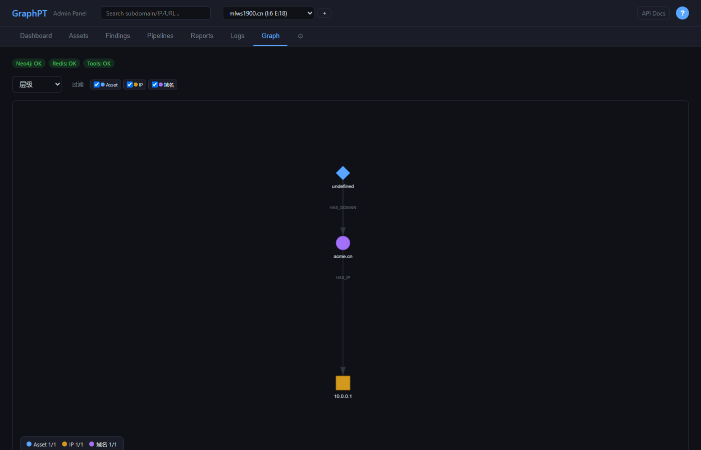
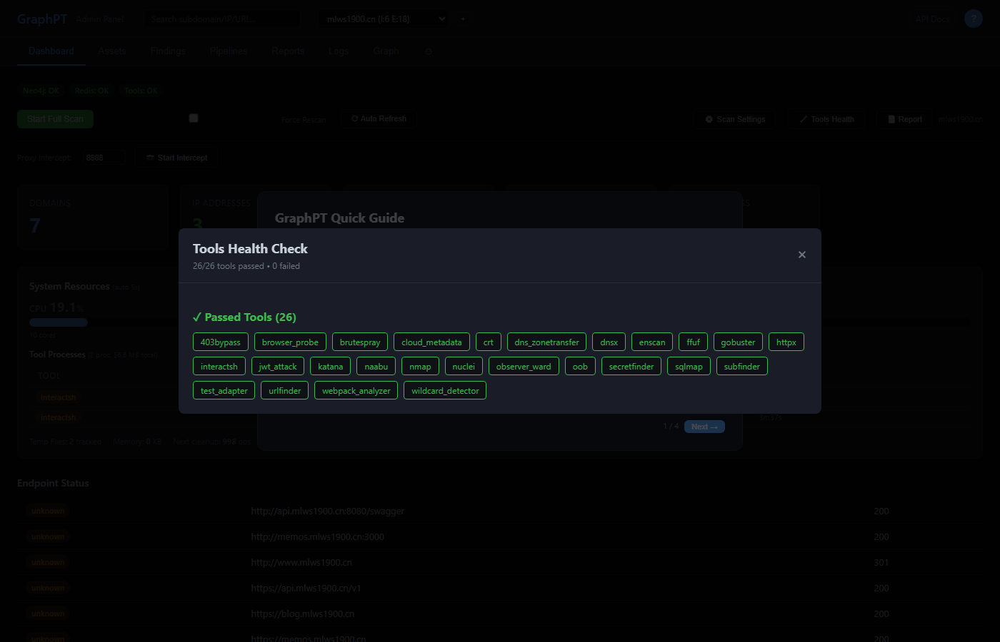
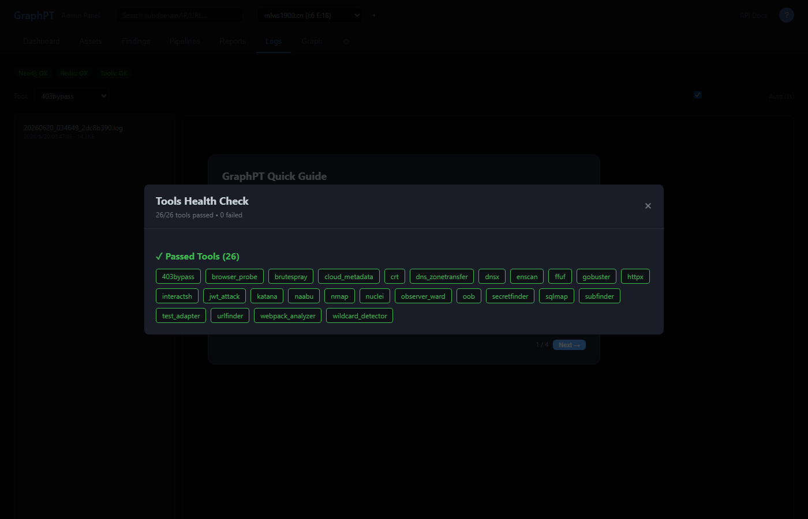

# GraphPT — 节点驱动的资产侦察平台

> **Node-driven reconnaissance platform** — tools consume graph nodes, layers emerge from data flow, no hardcoded pipelines needed.

GraphPT 是一个基于 **Neo4j 图数据库**的资产侦察平台。核心思路不是写死流水线顺序，而是让**数据流自然驱动扫描推进**——每个工具声明自己"吃什么类型的节点"（`use_on`），调度器从图里实时查询哪些节点还没被处理过（`NOT EXISTS ScanRun`），有就派发工具，没有就等待上层产出。上层没产出 → 下层自然查不到目标 → 无需人工编排依赖。

---

## 目录

- [核心理念：节点驱动 vs 流水线](#核心理念节点驱动-vs-流水线)
- [系统架构](#系统架构)
- [依赖层自动推导](#依赖层自动推导)
- [快速开始](#快速开始)
- [功能模块](#功能模块)
- [工具系统](#工具系统)
- [扫描配置](#扫描配置)
- [项目结构](#项目结构)
- [开发指南](#开发指南)

---

## 核心理念：节点驱动 vs 流水线

```
流水线模式（传统）:                    节点驱动模式（GraphPT）:
                                     ┌─────────────────────────────────┐
  Stage1 → Stage2 → Stage3           │  Neo4j 图数据库                  │
    │        │        │              │                                 │
    ▼        ▼        ▼              │  Asset ──HAS_DOMAIN──▶ Domain   │
  subfinder  dnsx    httpx           │    │                    │       │
                                     │    │                    ▼       │
  顺序写死在 YAML 里                   │    │         PARENT_OF  Subdomain
  一个阶段卡住全链阻塞                  │    │                    │       │
                                     │    ▼                    ▼       │
                                     │   IP ◀──RESOLVES_TO─────┘      │
                                     │    │                            │
                                     │    ▼                            │
                                     │  Port ──EXPOSES──▶ HTTPEndpoint│
                                     │                  │             │
                                     │                  ▼             │
                                     │            Vulnerability       │
                                     └─────────────────────────────────┘
                                               │
                                    调度器轮询每个工具的 Cypher 查询:
                                    "还有没处理过的 Port 吗？"
                                    → 有 → 派发 nmap
                                    → 没有 → 跳过，等下一轮
```

**核心理念（摘自 `scheduler.py` 注释）：**

> 节点驱动模式——顺序从数据流自然涌现: 每个工具的"就绪条件 + 去重"已编码在 targets.yaml 的 Cypher 里。dnsx 选"有 Subdomain 但还没 RESOLVES_TO IP 的"→ subfinder 没产出 Subdomain 时 dnsx 自然查不到目标。调度器只需轮询每个工具"有没有待处理目标"，有就派发。

**调度节奏**：同层并行、跨层自然涌现。
- **同层** = 消费同类节点的工具（crt / subfinder / urlfinder 都吃 RootDomain）→ 一起派发
- **跨层** = nmap 必须等 naabu 产出 Port → 靠 Cypher 查询空/非空自然门控

---

## 依赖层自动推导

调度器启动时扫描所有 `tools/*/tool.yaml` 的 `use_on` 字段，**自动构建依赖层**，无需手写：

```
_NODE_LAYER_ORDER = {
    Asset:      Layer 0
    RootDomain: Layer 1    → enscan, subfinder, crt, dns_zonetransfer, wildcard_detector
    Subdomain:  Layer 2    → dnsx
    IP:         Layer 3    → naabu
    Port:       Layer 4    → nmap
    Endpoint:   Layer 5    → httpx, observer_ward, katana, ffuf, gobuster, nuclei,
                              webpack_analyzer, browser_probe, secretfinder, urlfinder
    Vuln:       Layer 6    → sqlmap, jwt_attack, cloud_metadata, oob, interactsh
    Credential: Layer 7    → brutespray, 403bypass
}
```

**加新工具零配置**：创建 `tools/<name>/tool.yaml`，声明 `use_on: HTTPEndpoint` → 调度器自动归入 Layer 5，与其他 Endpoint 工具并行派发。

### 扫描执行流程

```
run_full_scan(asset_id)
  │
  ├─ 每层一个独立线程（7 层并行推进，不互相阻塞）
  │   Layer 1 线程: _count_targets(enscan) > 0? → 派发 enscan
  │                 _count_targets(subfinder) > 0? → 派发 subfinder
  │                 ...
  │   Layer 2 线程: _count_targets(dnsx) > 0? → 派发 dnsx
  │                 （无 Subdomain 则 _count_targets 返回 0，该层休眠）
  │   ...
  │
  ├─ 中止条件：所有层连续 N 次检查无目标 → 扫描完成
  │
  └─ 防重复：ScanRun 节点跟踪 "工具×目标" 已扫描记录
```

---

## 系统架构

```
┌──────────────────────────────────────────────────────────────┐
│                     Web UI (FastAPI + Vanilla JS)             │
│   Dashboard │ Assets │ Findings │ Pipelines │ Logs │ Graph   │
├──────────────────────────────────────────────────────────────┤
│              graphpt/web/app.py  (100+ API endpoints)         │
├──────────────────────────────────────────────────────────────┤
│                       调度器 (scheduler.py)                    │
│   ┌─────────────────────────────────────────────────────┐    │
│   │ _build_dependency_layers()                           │    │
│   │   tools/*/tool.yaml use_on → 自动推导 8 层依赖关系    │    │
│   │                                                      │    │
│   │ advance_once()                                       │    │
│   │   _count_targets(tool) → Cypher 查询待处理节点数      │    │
│   │   同层并行派发, 跨层自然门控                          │    │
│   │                                                      │    │
│   │ run_full_scan()                                      │    │
│   │   7 层独立线程, 自动调谐并发数                        │    │
│   └─────────────────────────────────────────────────────┘    │
├──────────────────────────────────────────────────────────────┤
│               PipelineExecutor (pipeline.py)                  │
│   解析命令模板 → subprocess 执行工具 → adapter 解析输出       │
│   → GraphWriter 写入 Neo4j → 标记 ScanRun                      │
├──────────────────┬──────────────────┬────────────────────────┤
│   Neo4j (graph)  │  Redis (cache)   │  File Storage (logs)   │
│   bolt://7687    │  localhost:6379  │  data/logs/<tool>/     │
└──────────────────┴──────────────────┴────────────────────────┘
```

### 关键组件

| 组件 | 文件 | 职责 |
|------|------|------|
| **调度器** | `scheduler.py` | 自动推导依赖层、并发控制、Redis 分布式锁、心跳检测、内存压力感知 |
| **执行器** | `pipeline.py` | 命令模板解析、subprocess 执行、adapter 输出解析、双 LIMIT 去重 |
| **图写入器** | `neo4j_client.py` | 幂等 MERGE、关系建立、变更追踪、多源收敛 |
| **适配器** | `adapter.py` | 动态发现 `tools/*/adapter.py`、`register_adapter()` 注册 |
| **验证器** | `validator.py` | 5 项启动前检查（二进制/配置/Cypher/适配器/查询） |

---

## 快速开始

### 环境要求

- **Python 3.11+**
- **Java 17+**（Neo4j 需要）
- **Redis** 或 Memurai（Windows 推荐 Memurai）
- 项目自带 `infra/neo4j/`（Neo4j 5.26）

### 启动

```bash
pip install -r requirements.txt

# 生产模式（自动启 Neo4j+Redis、崩溃自动重启）
python start.py

# 调试模式（跳过依赖检查、不自动重启）
python start.py --debug

# 自定义端口
python start.py --port 5000
```

浏览器打开 **http://localhost:8080**

`start.py` 启动后自动：
1. 检测/启动 Neo4j（`infra/neo4j/bin/neo4j.bat console`）
2. 检测/启动 Redis/Memurai
3. 启动 uvicorn Web 服务器
4. 崩溃 5 秒后自动重启（非 debug 模式）

---

## 功能模块

### 1. Dashboard 仪表盘



- **三色健康灯**：Neo4j / Redis / Tools 实时状态
- **资产统计卡片**：Domains / IPs / Ports / HTTP Endpoints / Scan Progress
- **操作区**：Start Full Scan / Force Rescan / Auto Refresh / Scan Settings / Tools Health
- **实时面板**：系统资源（CPU/内存/磁盘）、Endpoint 状态码分布、Recent Discoveries、Recent Errors
- **资产选择器**：顶部下拉切换 Asset，所有数据按资产隔离

### 2. Assets 资产管理



**创建资产**：顶部 `+` 按钮 → 填写公司名、Asset ID（slug）、根域名



**添加目标**：直接在 Assets 页用表单添加：
- Type 选择器：**Domain / IP / URL**
- Value 输入框：Enter 提交
- **Bulk Import**：批量粘贴，自动检测类型

**右键菜单**：右键目标行 → 选择工具单独执行

**双表展示**：
- **Seed Targets**：用户手动添加的初始目标
- **Discovered Assets**：扫描自动发现的子域名/IP/端口

### 3. Pipelines 流水线

> 注意：Pipelines 是节点驱动之上的**用户层编排工具**——预定义工具序列供一键执行，底层仍走调度器。



| 流水线 | 工具链 | 用途 |
|--------|--------|------|
| `company_recon` | enscan→subfinder→dnsx→naabu→nmap+httpx→katana+ffuf+gobuster→observer_ward→nuclei→403bypass | 全量公司侦察 |
| `port_discovery` | naabu→nmap+httpx | 快速端口发现 |
| `web_deep` | naabu→nmap+httpx→katana+ffuf→403bypass | 深度 Web 扫描 |
| `demo_chain` | subfinder→httpx→nuclei | 轻量验证链 |

新建/编辑/删除流水线均通过 Web UI 操作，持久化到 `data/pipelines.yaml`。

### 4. Findings 发现结果



统一展示所有工具的输出，按类型分 tab：
- Subdomains / IPs / Ports / HTTP Endpoints
- Vulnerabilities / Secrets / API Endpoints / Files

支持搜索、过滤、分页，每条结果标注来源工具和发现时间。

### 5. Graph 图可视化



vis-network 渲染 Neo4j 图：
- 节点类型：Asset → Domain → IP → Port → HTTPEndpoint → Vulnerability
- 关系边：HAS_DOMAIN / PARENT_OF / RESOLVES_TO / HAS_PORT / EXPOSES
- 支持缩放、拖拽、点击展开

### 6. Tools Health 工具健康检查



对每个工具执行 **5 项检查**（详见[工具验证机制](#工具验证机制)），26/26 全部通过才显示绿色 OK。

### 7. Logs 工具日志



- 每次工具执行生成独立日志：`data/logs/<tool>/<timestamp>_<uuid>.log`
- 按工具筛选、3 秒自动刷新
- 实时查看命令输出和错误信息

---

## 工具系统

### 工具目录（26 个）

| 工具 | 功能 | 消费节点 |
|------|------|----------|
| `enscan` | 企业 ICP/备案/分支域名 | RootDomain |
| `subfinder` | 子域名被动发现 | RootDomain |
| `crt` | 证书透明日志子域名 | RootDomain |
| `dns_zonetransfer` | DNS AXFR 域传送 | RootDomain |
| `wildcard_detector` | DNS 泛解析检测 | RootDomain |
| `dnsx` | DNS 批量解析 | Subdomain |
| `naabu` | 快速端口扫描 | IP |
| `nmap` | 服务版本识别 | Port |
| `httpx` | Web 指纹探测 | Endpoint |
| `observer_ward` | Web 指纹识别（EHole+FingerprintHub） | Endpoint |
| `katana` | Web 爬虫（headless JS 渲染） | Endpoint |
| `ffuf` | Web Fuzz 多模式 | Endpoint |
| `gobuster` | 目录/DNS/VHOST 扫描 | Endpoint |
| `urlfinder` | 被动 URL 收集（Wayback/OTX） | Endpoint |
| `secretfinder` | 敏感信息检测 | Endpoint/File |
| `webpack_analyzer` | JS Bundle API 提取 | Endpoint |
| `browser_probe` | 浏览器驱动端点发现 | Endpoint |
| `nuclei` | 漏洞扫描（YAML 模板） | Endpoint |
| `sqlmap` | SQLi 自动化利用 | Vulnerability |
| `jwt_attack` | JWT 弱点检测 | Vulnerability |
| `cloud_metadata` | 云元数据 SSRF 利用 | Vulnerability |
| `oob` | OOB 带外交互验证 | Vulnerability |
| `interactsh` | Interactsh OOB 客户端 | Vulnerability |
| `brutespray` | 弱口令爆破（40+ 协议） | Credential |
| `403bypass` | 403 绕过（16 种技术） | HTTPEndpoint |
| `test_adapter` | 适配器测试工具 | RootDomain |

### 工具三要素

每个工具由 3 个文件定义，位于 `tools/<name>/`：

#### tool.yaml — 声明"我吃什么节点, 怎么执行"

```yaml
desc: "子域名发现"
command: "{bin} -d {domain} -json"
use_on:
  Domain:                          # 消费 Domain 节点
    desc: "对根域名做子域名发现"
    params:
      domain: "{value}"
```

`{bin}` 自动解析为工具可执行路径。`use_on` 决定调度器把它归入哪一层。

#### targets.yaml — Cypher 查询"哪些节点还没被处理过"

```yaml
selectors:
  subfinder:
    query: |
      MATCH (a:Asset {id: $asset_id})
      MATCH (a)-[:HAS_DOMAIN]->(d:Domain)
      WHERE d.is_root = true
        AND NOT EXISTS { MATCH (sr:ScanRun)
          WHERE sr.tool = $tool AND sr.target = d.value }
      RETURN d.value AS domain
    mapping:
      domain: "{domain}"
```

关键设计：`NOT EXISTS ScanRun` 保证幂等——已扫过的目标不会重复派发。Force Rescan 模式下自动移除此子句。

#### adapter.py — 解析工具输出 → 统一 Finding

```python
from graphpt.collector.adapter import BaseAdapter, register_adapter

class SubfinderAdapter(BaseAdapter):
    tool_name = "subfinder"
    def parse(self, raw_output, **ctx) -> list[dict]:
        return [{"type": "subdomain", "value": "sub.example.com", ...}]

register_adapter("subfinder", SubfinderAdapter)
```

所有 Finding 通过 `GraphWriter` 统一写入 Neo4j（幂等 MERGE + 关系建立 + 来源追踪）。

### 工具验证机制

`/api/tools/validate` 对每个工具执行 5 项检查：

| # | 检查项 | 方法 | 确认方式 |
|---|--------|------|----------|
| 1 | `binary_exists` | `_find_tool()` 按 6 级优先级搜索 | 文件存在 |
| 2 | `tool_yaml` | YAML 解析 `tools/<name>/tool.yaml` | `command` 字段非空 |
| 3 | `targets_yaml` | `_load_target_selectors()` 扫描 | MATCH + RETURN 存在 |
| 4 | `adapter` | `importlib` 动态加载 `adapter.py` | `ADAPTER_MAP` 注册 + `parse()` 存在 |
| 5 | `neo4j_query` | 真实执行 `query + " LIMIT 1"` | 不抛异常 |

**二进制查找优先级**（`_find_tool`）：
1. `tools/<name>.exe`
2. `tools/<name>/<name>.py` ← Python 包装脚本优先
3. `tools/<name>/<name>.exe`
4. `tools/<name>.py`
5. `PATH` 中的 `<name>`
6. `known{}` 已知路径（Go 工具链 / nmap）

---

## 扫描配置

### 三层字典方案

Dashboard → Scan Settings 为每个资产选择扫描深度：

| Profile | DNS 字典 | Web 字典 | 预计耗时 |
|---------|----------|----------|----------|
| **quick** | 5,000 | 4,700 | ~5 分钟 |
| **standard** | 100,000 | 30,000 | ~30 分钟 |
| **deep** | 2,100,000 | 1,200,000 | ~2 小时 |

工具命令中 `{wordlist:dns_subdomains}` 占位符由 PipelineExecutor 运行时解析。

### 资源自动调谐（`_auto_tune`）

调度器根据物理内存自动计算并发参数，无需手动调优：

| 物理内存 | 并发数 | 单工具内存上限 |
|----------|--------|----------------|
| < 4 GB | 1 | 512 MB |
| 4–8 GB | 1 | 1 GB |
| 8–16 GB | 2 | 2 GB |
| 16–32 GB | 4 | 4 GB |
| 32–64 GB | 6 | 6 GB |
| > 64 GB | 8 | 8 GB |

环境变量 `GRAPHPT_CONCURRENCY` / `GRAPHPT_MAX_TOOL_MEM_MB` 可覆盖自动值。

---

## 项目结构

```
GraphPT/
├── start.py / start.bat        # 入口（服务管理、崩溃自动重启）
├── graphpt/
│   ├── collector/              # 扫描引擎
│   │   ├── scheduler.py        # ★ 节点驱动调度器（自动推导依赖层）
│   │   ├── pipeline.py         # 工具执行器（命令模板、subprocess）
│   │   ├── tasks.py            # _find_tool 二进制发现
│   │   ├── neo4j_client.py     # GraphWriter（幂等写入、关系建立）
│   │   ├── adapter.py          # 适配器基类 + 自动发现
│   │   ├── validator.py        # 工具 5 项验证
│   │   ├── scan_config.py      # 三层字典配置
│   │   └── cleanup.py          # 临时文件/进程清理
│   ├── web/                    # FastAPI + Vanilla JS SPA
│   │   ├── app.py              # 100+ API endpoints
│   │   ├── static/             # 前端（HTML/JS/CSS, ES modules）
│   │   └── routes/             # 子路由（schema 可视化）
│   ├── common/                 # 共享工具（Redis/路径/日志）
│   ├── catalog/                # 节点类型注册表
│   └── reporter/               # 报告生成
├── tools/                      # 26 个安全工具
│   └── <name>/
│       ├── tool.yaml           # desc + command + use_on
│       ├── targets.yaml        # Cypher 目标选择器
│       └── adapter.py          # 输出适配器
├── infra/                      # 嵌入式基础设施
│   ├── neo4j/                  # Neo4j 5.26
│   └── memurai/                # Windows Redis
├── data/                       # 运行时数据
│   ├── assets/                 # 资产配置
│   ├── logs/                   # 工具日志（按工具分目录）
│   └── tmp/                    # 临时文件
├── res/                        # 静态资源
│   ├── wordlists/              # 字典文件
│   └── fingerprints_ehole.json
├── docs/                       # 文档 + 截图
├── scripts/                    # 迁移脚本
└── tests/                      # 测试
```

---

## 开发指南

### 添加新工具（3 个文件即可）

```
tools/<name>/
├── tool.yaml       # desc + command + use_on（决定归入哪一层）
├── targets.yaml    # Cypher 查询（哪些节点待处理）
└── adapter.py      # parse(raw_output) → list[Finding]
```

调度器自动发现并归入正确的依赖层，**无需修改任何调度代码**。

### 代码风格

- **Python**：类型提示、单一职责、边界验证、不写不言自明的注释
- **前端**：原生 JS ES modules、fetch API、无框架

### 测试

```bash
python -m pytest tests/
python tests/wordlist/test_real_pipeline.py
```

---

## 截图索引

| 页面 | 文件 |
|------|------|
| Dashboard | `docs/screenshots/01-dashboard.png` |
| Assets（添加目标表单） | `docs/screenshots/02-assets.png` |
| Pipelines（流水线列表） | `docs/screenshots/03-pipelines.png` |
| Findings（发现结果） | `docs/screenshots/04-findings.png` |
| Graph（图可视化） | `docs/screenshots/05-graph.png` |
| Tools Health（26/26 通过） | `docs/screenshots/06-tools-health.png` |
| New Asset（创建资产弹窗） | `docs/screenshots/07-new-asset.png` |
| Logs（工具日志） | `docs/screenshots/08-logs.png` |

---

## License

MIT
