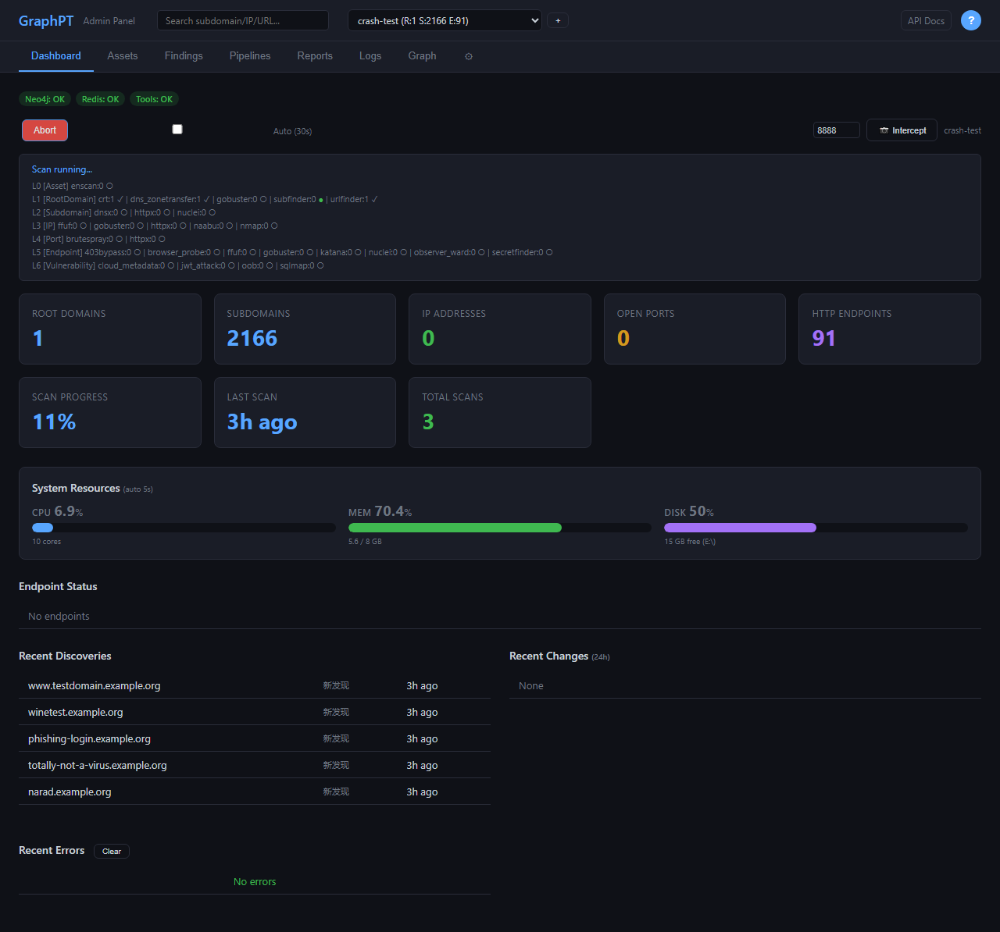
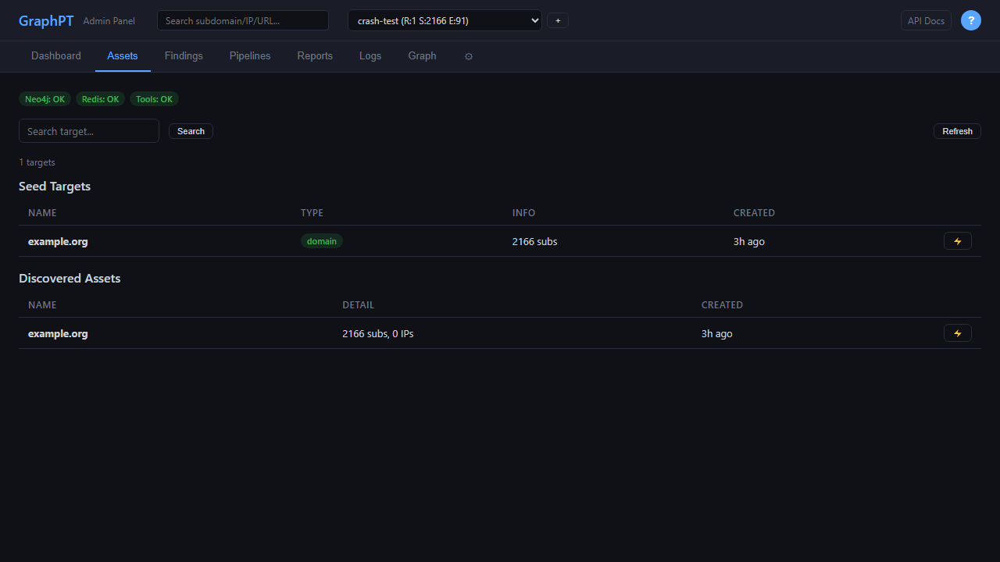
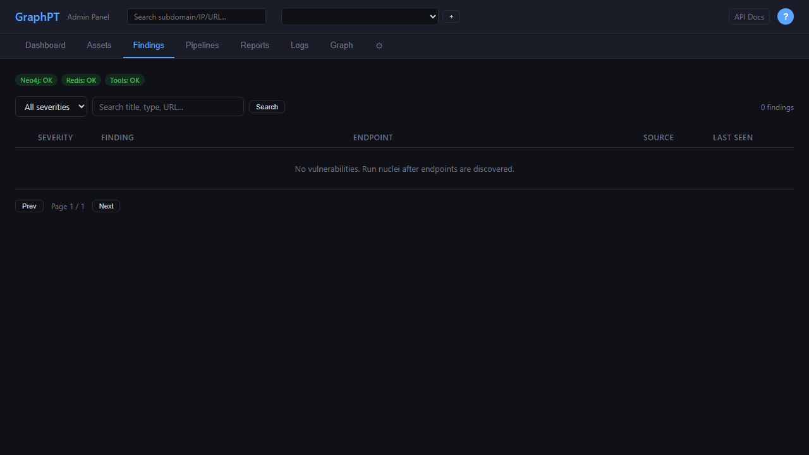
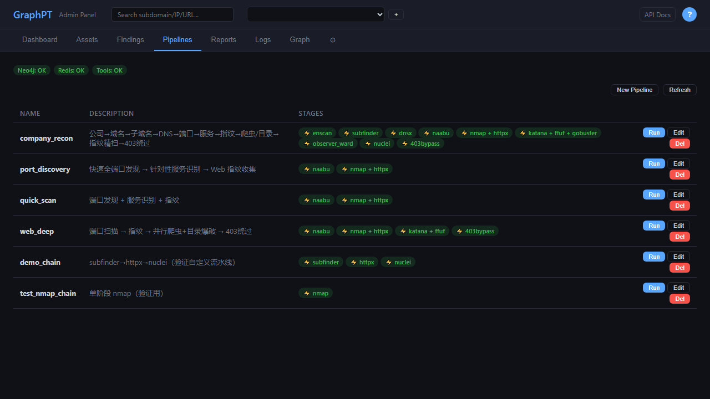
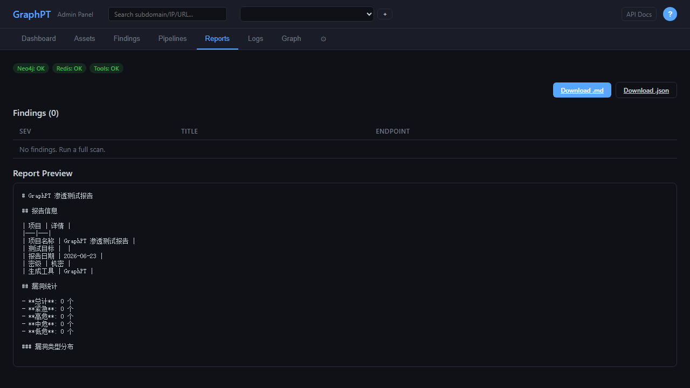
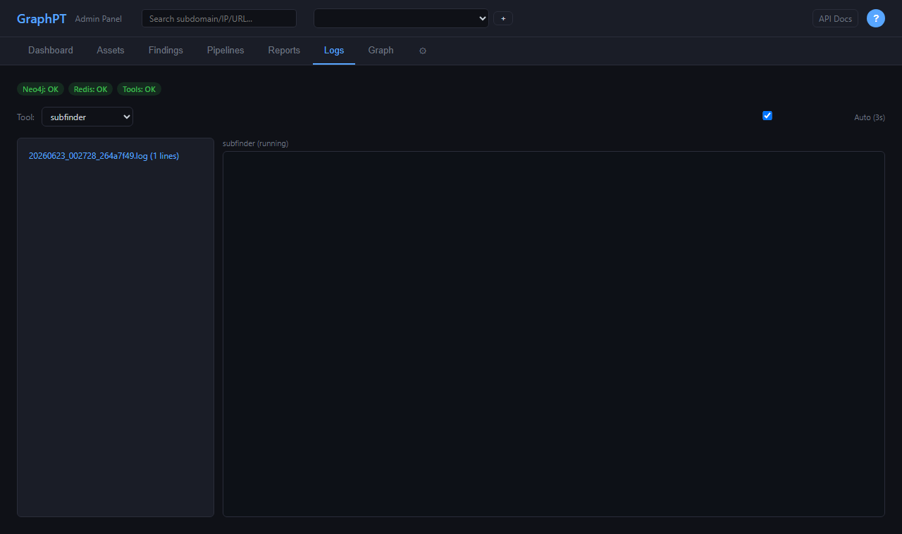
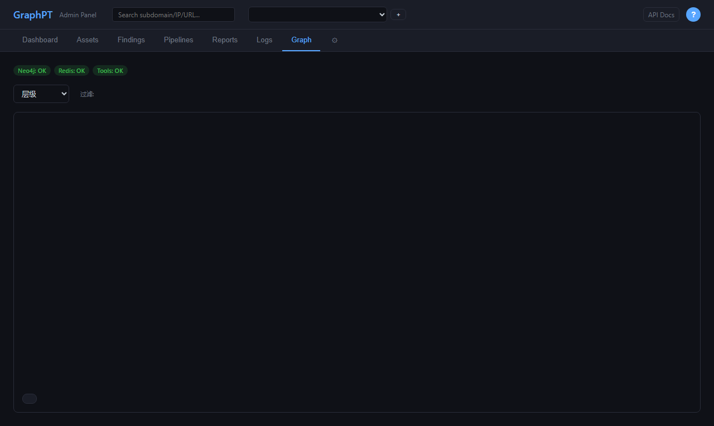
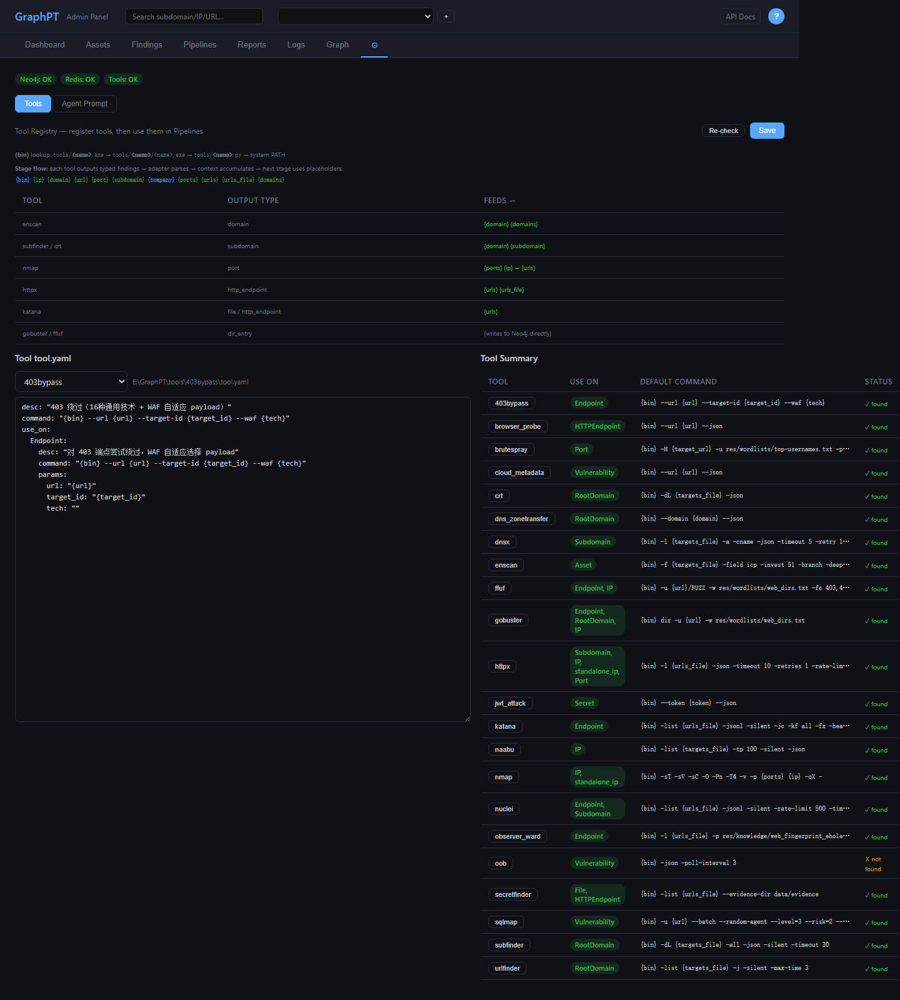

# GraphPT —— AI 驱动的自主渗透测试平台

> 8 层攻击链自动循环 · 图数据库资产关联 · Web 管理面板 · 一键 MITM 流量拦截

---

## 功能概览

| 模块 | 说明 |
|------|------|
| **Dashboard** | 实时系统健康 / 资产统计 / 扫描进度 / 系统资源 / 进程状态 / 错误面板 |
| **Assets** | 资产发现结果树形展示，Seed Target + Discovered Assets 双表 |
| **Findings** | 漏洞清单，按严重度筛选（Critical / High / Medium / Low / Info） |
| **Pipelines** | 自定义工具流水线，7 条预置链，可视化编辑/运行/删除 |
| **Reports** | 一键生成渗透测试报告（Markdown / JSON），实时预览 |
| **Logs** | 工具执行日志实时流，按工具/资产过滤，自动刷新 |
| **Graph** | Neo4j 图可视化（vis-network），层级/力导向/径向布局，可拖拽缩放 |
| **Settings** | 22 工具注册表热编辑 + AI Agent 系统提示词完整自定义 |

---

## 截图

### 🖥 Dashboard


### 📁 Assets


### 🐛 Findings


### ⛓ Pipelines


### 📝 Reports


### 📜 Logs


### 🕸 Graph


### ⚙ Settings


---

## 架构

```
┌─────────────────────────────────────────────────────┐
│                    Web 管理面板                        │
│  FastAPI + 静态 SPA（vis-network 图可视化）             │
│  7 个功能页面 + 实时轮询 + Neo4j 直连查询               │
├─────────────────────────────────────────────────────┤
│                    Core Agent 层                      │
│  LLM ReAct 循环 → 自主决策攻击路径                      │
│  Neo4j 图查询 → 缺口分析 → 工具触发 → 结果回图            │
├─────────────────────────────────────────────────────┤
│                    Collector 采集引擎                   │
│  ThreadPoolExecutor → Pipeline 调度 → 22 工具直接执行      │
│  结果写入 Neo4j 图数据库（GraphWriter）                   │
├─────────────────────────────────────────────────────┤
│                    Neo4j 图数据库                        │
│  Asset → RootDomain → Subdomain → IP → Port            │
│  → HTTPEndpoint → Vulnerability → Secret              │
│  关系追踪 + 来源溯源（sources[]）+ 时间戳                  │
└─────────────────────────────────────────────────────┘
```

---

## 快速开始

### 环境要求

- **Python** 3.11+
- **Neo4j** 5.x（bolt://localhost:7687）
- **Redis**（localhost:6379）
- **Windows** / Linux / macOS

### 安装与启动

```bash
# 1. 安装 Python 依赖
python install.py

# 2. 配置 .env（Neo4j / Redis / 工具路径 / 超时等，14 个模块分类）
cp .env.example .env   # 按需编辑

# 3. 启动所有服务
python start.py

# 4. 打开浏览器
#    http://127.0.0.1:8080

# 5. 停止
python stop.py
```

### 启动后的操作

1. 点击资产选择器旁边的 **+** 按钮创建资产（公司域名/IP）
2. 选择资产，点击 **Start Full Scan** 开始全量扫描
3. 等待 7 层自动循环推进，或随时 **Abort** 中止
4. 扫描完成后查看 **Findings** 漏洞清单、**Reports** 生成报告

---

## 8 层攻击链

点一次 `Start Full Scan`，系统按层自动推进，每层内工具并行执行，层间逐级依赖：

| 层级 | 目标类型 | 工具 | 产出 |
|------|----------|------|------|
| **L0** | Asset | `enscan` | RootDomain（ICP/投资关系/分支机构） |
| **L1** | RootDomain | `subfinder` `crt` `urlfinder` `gobuster` `dns_zonetransfer` | Subdomain |
| **L2** | Subdomain | `dnsx` `nuclei` `httpx` | IP + HTTPEndpoint + Vulnerability |
| **L3** | IP | `naabu` `nmap` `httpx` `ffuf` `gobuster` | Port + Service |
| **L4** | Port | `brutespray` `httpx` | Credential + HTTPEndpoint |
| **L5** | Endpoint | `nuclei` `katana` `ffuf` `gobuster` `403bypass` `observer_ward` `secretfinder` `browser_probe` | Vulnerability + File + Secret + DirEntry |
| **L6** | Vulnerability | `sqlmap` `oob` `jwt_attack` `cloud_metadata` | 确认漏洞 |

- `●` 正在运行 · `✓` 已完成 · `○` 待运行
- 数字 = 本轮 ScanRun 数量
- 自动循环直到所有工具完成，或手动 Abort

---

## 22 个集成工具

### 外部工具（需自行下载到 `tools/<name>/`，`tool.yaml` 已在仓库中）

| 工具 | 功能 | 下载 |
|------|------|------|
| **enscan** | 企业 ICP/备案/分支域名收集 | [ENScan_GO](https://github.com/wgpsec/ENScan_GO) |
| **subfinder** | 子域名枚举 | [subfinder](https://github.com/projectdiscovery/subfinder) |
| **dnsx** | DNS 解析（A/CNAME/CDN） | [dnsx](https://github.com/projectdiscovery/dnsx) |
| **naabu** | 快速端口扫描 | [naabu](https://github.com/projectdiscovery/naabu) |
| **nmap** | 服务版本/OS 识别 | [nmap](https://nmap.org/download) |
| **httpx** | Web 指纹探测（状态码/标题/技术栈） | [httpx](https://github.com/projectdiscovery/httpx) |
| **nuclei** | 漏洞扫描（模板引擎） | [nuclei](https://github.com/projectdiscovery/nuclei) |
| **katana** | Web 爬虫（headless JS 渲染） | [katana](https://github.com/projectdiscovery/katana) |
| **observer_ward** | Web 指纹识别（FingerprintHub+EHole） | [observer_ward](https://github.com/emo-crab/observer_ward) |
| **ffuf** | Web Fuzzing / 虚拟主机发现 | [ffuf](https://github.com/ffuf/ffuf) |
| **gobuster** | 目录/DNS/虚拟主机多模式扫描 | [gobuster](https://github.com/OJ/gobuster) |
| **urlfinder** | 被动 URL 收集（Wayback/CommonCrawl/OTX） | [urlfinder](https://github.com/projectdiscovery/urlfinder) |
| **brutespray** | 弱口令爆破（40+ 协议） | [brutespray](https://github.com/x90skysn3k/brutespray) |
| **crt** | 证书透明日志子域名发现 | [crt](https://github.com/emblemparade/crt) |

### 自研脚本工具（随仓库分发）

| 工具 | 功能 |
|------|------|
| **403bypass** | 403 访问绕过（路径变异 / Header 覆盖 / IP 伪造 / 方法切换 / 全量技术集） |
| **browser_probe** | 浏览器驱动端点发现（JS 渲染后提取隐藏链接/表单/API） |
| **cloud_metadata** | 云元数据 SSRF 利用（探测 AWS/GCP/Azure 等凭证） |
| **dns_zonetransfer** | DNS 域传送攻击（AXFR 获取全部子域名） |
| **jwt_attack** | JWT 弱点检测（alg=none / 弱 HMAC / kid 注入） |
| **oob** | 带外交互验证（轮询 interactsh 回调并关联漏洞） |
| **secretfinder** | 全量敏感信息检测（JS/HTML 中挖掘 API Key / Token / 密码） |
| **sqlmap** | SQLi 自动化利用（封装 sqlmap，batch 模式自动注入） |

---

## MITM 流量拦截

Dashboard 点击 **📷 Intercept** 启动 mitmproxy，设浏览器代理后所有 HTTP/HTTPS 流量自动入 Neo4j：

- 域名/子域名 → `Subdomain` 节点
- IP 地址 → `IP` 节点
- URL 端点 → `HTTPEndpoint` 节点
- JS/CSS/图片 → `File` 节点

---

## 项目结构

```
GraphPT/
├── graphpt/
│   ├── cli/            # 交互式 CLI（prompt_toolkit，斜杠命令）
│   ├── collector/      # 采集引擎（ThreadPoolExecutor + Pipeline 调度 + Neo4j 写入）
│   ├── core/           # AI Agent 核心（ReAct 决策循环、提示词、工具调度）
│   ├── common/         # 公共模块（配置、日志、Redis 客户端）
│   ├── db/             # SQLite Schema（campaign 持久化）
│   ├── catalog/        # Neo4j 图模型定义
│   ├── tools/          # 工具注册、执行器、MCP 集成
│   ├── web/            # FastAPI Web 服务 + 静态前端（SPA）
│   └── workspace/      # 工作空间与资产管理
├── tools/              # 外部工具二进制 + tool.yaml 配置
├── res/                # 资源文件（字典、PoC、指纹库、nuclei-templates）
├── docs/               # 文档 + 截图
├── start.py            # 一键启动
├── stop.py             # 一键停止
├── install.py          # 依赖安装
├── requirements.txt    # Python 依赖
└── .env                # 运行配置（14 个模块，完整注释）
```

---

## 配置

### 核心环境变量（.env）

| 变量 | 说明 | 默认 |
|------|------|------|
| `NEO4J_URI` | Neo4j Bolt 地址 | `bolt://localhost:7687` |
| `NEO4J_PASSWORD` | Neo4j 密码 | `graphpt123` |
| `GRAPHPT_REDIS_URL` | Redis 地址 | `redis://localhost:6379/0` |
| `GRAPHPT_STALE_TIMEOUT` | 进程活性超时（秒） | `300` |
| `GRAPHPT_VERIFICATION_GRACE` | enscan 验证宽限期（秒） | `600` |
| `GRAPHPT_MAX_TOOL_TIME` | 单工具最大运行时间（秒） | `1800` |
| `GRAPHPT_ERROR_TTL_HOURS` | 错误日志保留时间（小时） | `24` |

### 工具配置（`tools/<name>/tool.yaml`）

```yaml
desc: "工具描述"
command: "{bin} -flag {param}"        # 命令模板
use_on:
  NodeType:                            # 适用的 Neo4j 节点类型
    desc: "何时使用"
    command: "{bin} mode -flag {target}"  # 可选：按上下文覆盖命令
    params:
      param: "{value}"
```

支持占位符：`{bin}` `{ip}` `{domain}` `{subdomain}` `{url}` `{port}` `{ports}` `{urls}` `{urls_file}` `{targets_file}` `{company}`

---

## 技术栈

| 组件 | 技术 |
|------|------|
| 后端 | Python 3.11+ / FastAPI / ThreadPoolExecutor / asyncio |
| 数据库 | Neo4j 5.x（图）+ SQLite（campaign） |
| 消息队列 | Redis |
| 前端 | Vanilla JS SPA / vis-network / CSS 变量主题 |
| Agent | LLM ReAct 循环（Anthropic Claude API / OpenAI 兼容） |
| 流量拦截 | mitmproxy（Python API，动态端口） |

---

## 许可证

MIT
